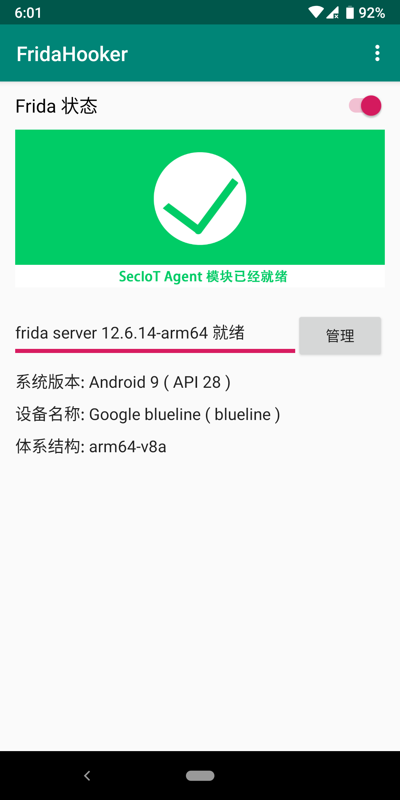

# FridaHooker
- 图形界面版本的Frida，提供一个方便地管理frida的方式，告别命令行。

## 主要功能
- 从本地安装frida server到root后的手机
- 从服务器上检索frida版本并安装frida server到root后的手机（功能测试中）
- 启动、关闭frida server

## 环境配置
- 系统要求：Android 5.0或更高版本，需要应用具有root权限。

## 截图

